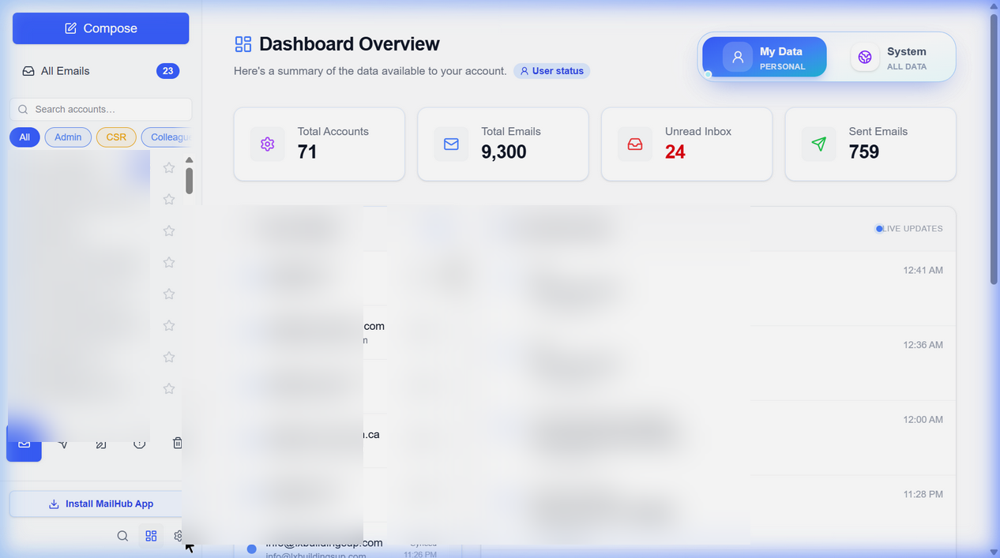
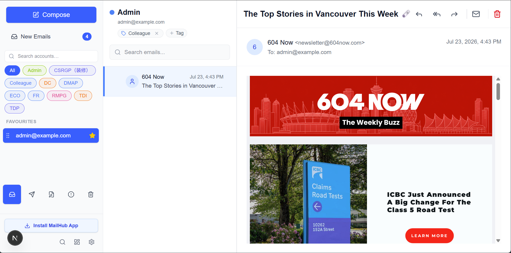
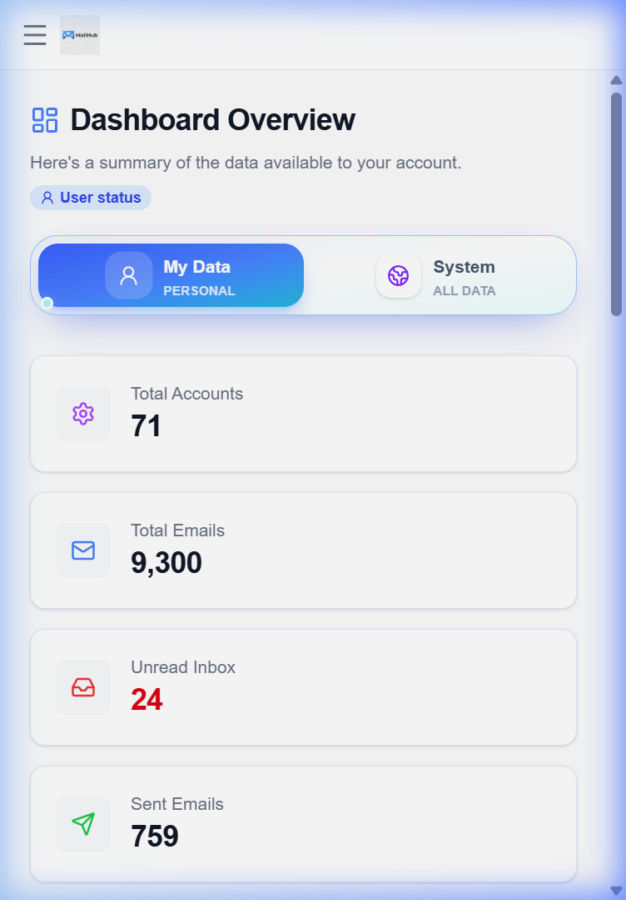

<div align="center">
  
  <h1>MailHub</h1>
  <p>A multi-tenant email management platform built with Next.js 16. Connect IMAP/SMTP, Gmail OAuth, or Microsoft/Outlook OAuth accounts, sync emails via background workers, and manage everything from a unified dashboard with full-text search, drag-and-drop labels, activity logs, spam risk detection, granular member access control, Progressive Web App (PWA) support, and Web Push notifications.</p>

  <p>
    <a href="https://github.com/sponsors/kawing11a"></a>
    <a href="https://www.buymeacoffee.com/kawing11a"></a>
  </p>
</div>

## Screenshots & Demo

<div align="center">
  
</div>

<br />

| Dashboard Overview | Multi-Account Email Stream | Mobile Responsive View |
|:---:|:---:|:---:|
|  |  |  |

## Why MailHub?

Managing multiple email accounts across local clients is a disjointed, sluggish experience. MailHub redesigns this workflow from the ground up:

- 📬 **Aggregated Stream (Unified Context)**: No more clicking through 10 different mailboxes. MailHub unifies all your IMAP and OAuth accounts into a single, unified email feed.
- ⚙️ **Server-Side Decoupling**: Heavy syncing tasks are fully handled by backend BullMQ workers on your server. Your frontend Next.js 16 dashboard remains ultra-lightweight and buttery smooth, no matter how many accounts you add.
- ⚡ **Instant Global Search**: Powered by Meilisearch. Search through hundreds of thousands of emails across all connected accounts simultaneously with millisecond-level results.
- 🌐 **Setup Once, Access Anywhere**: Being a Self-hosted PWA, you only configure your email accounts once on your server. Any desktop or mobile device can then instantly access the fully synced dashboard without tedious re-configurations.

## Tech Stack

| Layer | Technology |
|---|---|
| **Framework** | Next.js 16 (App Router) |
| **Language** | TypeScript 5 |
| **PWA / Client** | Service Worker, Web App Manifest, `usePWAInstall` hook, `@dnd-kit` (Drag & Drop) |
| **Database** | PostgreSQL 16 + Prisma ORM 7 (`@prisma/adapter-pg`) |
| **Search** | Meilisearch |
| **Queue / Cache** | Redis 7 + BullMQ |
| **Auth** | JWT (`jose`) + `bcryptjs` |
| **Email Protocols** | IMAP (`imapflow`) · SMTP (`nodemailer`) · Gmail OAuth 2.0 API · Microsoft Outlook OAuth 2.0 API |
| **UI** | React 19, Tailwind CSS 4, Lucide Icons, TipTap editor, Local `geist` fonts |
| **State** | Zustand + TanStack React Query |
| **Notifications** | Web Push (`web-push` + VAPID) |
| **Testing** | Jest + `ts-jest` |
| **Containerization** | Docker multi-stage build + Docker Compose |

## Key Features

- 📧 **Multi-Account & Multi-Tenant**: Connect multiple IMAP/SMTP, Gmail OAuth, or Microsoft Outlook OAuth mailboxes across isolated organization workspaces.
- 👥 **Granular Access Control**: Organization administrators can manage and grant per-member access permissions to specific email accounts.
- ⚡ **Realtime Email Sync**: High-throughput background sync powered by BullMQ workers with automatic SPAM detection and Meilisearch indexation.
- 📤 **Multi-Provider Email Sender**: Send emails using native SMTP, Google Gmail API, or Microsoft Graph/Outlook API with automatic token refreshing.
- 📬 **Aggregated All Emails View**: View and filter emails across all connected accounts simultaneously in a unified stream, complete with customizable reading pane layouts (Right, Bottom, or Off).
- 🗑️ **Trash & Restore Flow**: Full support for moving emails to Trash, restoring messages back to inbox/folders, and emptying trash per account.
- 🔍 **Instant Full-Text Search**: Search headers, body content, and senders seamlessly across all connected accounts powered by Meilisearch.
- 🏷️ **Drag & Drop Label Management**: Organize emails using customizable organization labels and interactive drag-and-drop actions.
- 📱 **Progressive Web App (PWA)**: Installable desktop/mobile experience with offline Service Worker caching, automated background update polling, system installation detection, and dynamic UI install buttons.
- 🔔 **Real-Time SSE & Push Notifications**: Instant inbox updates via Server-Sent Events (SSE) and native Web Push notifications.

## Architecture

```
┌──────────────┐     ┌──────────────┐     ┌──────────────┐
│ Next.js App  │────▶│  PostgreSQL  │◀────│   Workers    │
│ (PWA + API)  │     │  (Prisma)    │     │  (BullMQ)    │
└──────┬───────┘     └──────────────┘     └──────┬───────┘
       │                                         │
       │             ┌──────────────┐            │
       ├────────────▶│  Meilisearch │◀───────────┤
       │             │  (Search)    │            │
       │             └──────────────┘            │
       │             ┌──────────────┐            │
       └────────────▶│    Redis     │◀───────────┘
                     │  (Queue/SSE) │
                     └──────────────┘
```

- **Next.js App** — serves the dashboard UI, handles PWA service worker lifecycle, and exposes REST API routes.
- **Workers** — background processes that sync email via IMAP/Gmail/Outlook, managed by BullMQ. Horizontally scalable with partition keys (`WORKER_PARTITION`).
- **Redis** — backs the BullMQ job queue and server-sent events for realtime updates.
- **Meilisearch** — powers instant full-text search across all synced emails.
- **PostgreSQL** — primary data store for users, organizations, email accounts, permissions, emails, labels, favorites, and activity logs.

## Data Model

Core entities managed via Prisma:

- **User** — authentication identity (email + password hash)
- **Organization** — multi-tenant workspace (slug-based)
- **OrganizationMember** — user ↔ org membership with role permissions
- **EmailAccount** — connected mailbox (IMAP/SMTP creds or OAuth tokens, encrypted at rest)
- **MemberEmailAccountAccess** — granular per-member access permissions for specific email accounts
- **Email / EmailBody / Attachment** — synced messages, bodies, and file metadata
- **Label / AccountLabel / EmailLabel** — workspace and account-level labels applied to messages
- **EmailActivityLog** — detailed audit log of email operations
- **PushSubscription** — Web Push endpoints per organization user
- **FavoriteEmail** — starred/favorited emails tracking per user account

## Getting Started

### Prerequisites

- **Node.js** ≥ 20
- **Docker** & **Docker Compose** (for PostgreSQL, Redis, Meilisearch)

### 1. Clone & Install

```bash
git clone https://github.com/kawing11a/mailhub.git
cd mailhub
npm install
```

### 2. Environment Variables

```bash
cp .env.example .env
```

Edit `.env` with your values. Required variables:

| Variable | Description |
|---|---|
| `DATABASE_URL` | PostgreSQL connection string |
| `REDIS_URL` | Redis connection string |
| `MEILI_HOST` | Meilisearch URL |
| `MEILI_MASTER_KEY` | Meilisearch admin key |
| `JWT_SECRET` | Secret for signing JWT tokens |
| `ENCRYPTION_KEY` | 64-char hex key for encrypting stored credentials |
| `NEXT_PUBLIC_APP_URL` | Base application URL (e.g. `https://localhost:3000`) |
| `GOOGLE_CLIENT_ID` | OAuth 2.0 Client ID for Google Workspace / Gmail |
| `GOOGLE_CLIENT_SECRET` | OAuth 2.0 Client Secret for Google Workspace / Gmail |
| `AZURE_CLIENT_ID` | OAuth 2.0 Application (Client) ID for Microsoft Outlook |
| `AZURE_CLIENT_SECRET` | OAuth 2.0 Client Secret for Microsoft Outlook |
| `AZURE_TENANT_ID` | Azure Tenant ID (e.g., `common` or specific Directory ID) |

### 3. Start Services

```bash
# Start PostgreSQL, Redis, and Meilisearch
npm run services:up
```

### 4. Database Setup

```bash
npx prisma generate
npx prisma migrate deploy
```

To create an initial admin account for a clean deployment:

```bash
npm run create-admin
# Or pass parameters inline:
npm run create-admin admin@example.com "Admin User" "Password123!" "My Organization"
```

To seed test data (optional):

```bash
npm run db:seed
```

### 5. Run the App

```bash
# Development server (with experimental HTTPS for PWA & OAuth)
npm run dev
```

Open [https://localhost:3000](https://localhost:3000).

### 6. Run a Worker (optional)

Workers sync email accounts in the background:

```bash
npm run worker
```

### 7. Run Tests

To execute unit and API endpoint tests:

```bash
npm test
```

## API Routes

| Method | Route | Description |
|---|---|---|
| POST | `/api/auth/register` | Register new user + organization |
| POST | `/api/auth/login` | Authenticate and receive JWT |
| POST | `/api/auth/logout` | Clear authentication session |
| GET | `/api/auth/me` | Fetch active user profile |
| POST | `/api/auth/password` | Update user account password |
| GET | `/api/accounts` | List connected email accounts |
| POST | `/api/accounts` | Add an email account (IMAP/SMTP or OAuth) |
| DELETE | `/api/accounts/[id]` | Remove connected email account |
| POST | `/api/accounts/[id]/test` | Test IMAP/SMTP connection settings |
| POST | `/api/accounts/[id]/read-all` | Mark all emails in account as read |
| POST | `/api/accounts/[id]/reindex` | Trigger Meilisearch reindexing for account |
| GET | `/api/accounts/[id]/stats` | Fetch synchronization and message stats |
| GET | `/api/accounts/[id]/emails` | Fetch emails for account folder |
| POST | `/api/accounts/[id]/emails/send` | Send email via SMTP, Gmail, or Microsoft OAuth API |
| GET/PATCH/DEL | `/api/accounts/[id]/emails/[emailId]` | Fetch details, update status/starred, or trash/delete email |
| POST | `/api/accounts/[id]/emails/[emailId]/restore` | Restore email from trash to original folder |
| GET | `/api/accounts/[id]/emails/[emailId]/attachments/[attachmentId]` | Download email attachment |
| POST | `/api/accounts/[id]/emails/empty-trash` | Purge all emails in trash for account |
| GET/POST | `/api/accounts/[id]/drafts` | Manage email drafts |
| POST | `/api/accounts/[id]/drafts/sync` | Sync local email draft to server |
| GET | `/api/accounts/oauth/google/init` | Initiate Google OAuth 2.0 authorization |
| GET | `/api/accounts/oauth/google/callback` | Google OAuth 2.0 callback redirect |
| GET | `/api/accounts/oauth/microsoft/init` | Initiate Microsoft Outlook OAuth 2.0 authorization |
| GET | `/api/accounts/oauth/microsoft/callback` | Microsoft Outlook OAuth 2.0 callback redirect |
| GET | `/api/emails/new` | Aggregated stream of recent emails across all accounts |
| GET | `/api/emails/search` | Full-text search across emails (Meilisearch) |
| GET | `/api/emails/thread/[threadId]` | Fetch email thread by thread ID |
| POST | `/api/emails/labels` | Apply or remove labels from emails |
| GET/POST | `/api/labels` | List or create organization labels |
| PATCH/DELETE | `/api/labels/[id]` | Update or delete organization label |
| GET/POST | `/api/labels/[id]/emails` | Manage emails assigned to label |
| GET/POST | `/api/labels/[id]/accounts` | Manage accounts assigned to label |
| GET/POST/DEL | `/api/favourites` | Manage user favorite emails |
| POST | `/api/favourites/reorder` | Reorder user favorite items |
| GET | `/api/org` | Organization details |
| GET | `/api/org/members` | Organization members list |
| PATCH/DELETE | `/api/org/members/[userId]` | Update member role or remove member |
| GET/POST | `/api/org/members/[userId]/accounts` | Manage member access control for accounts |
| GET | `/api/activity` | Fetch activity audit log |
| GET | `/api/dashboard` | Dashboard summary stats |
| GET | `/api/realtime/stream` | SSE stream for live updates |
| GET | `/api/version` | Service Worker app version check |
| GET | `/api/pwa` | Check PWA system status |
| POST | `/api/notifications/subscribe` | Register Web Push subscription |
| POST | `/api/notifications/test` | Send test Web Push notification |

## Dashboard Pages

| Route | Page |
|---|---|
| `/login` | Sign in page |
| `/register` | Sign up page |
| `/inbox` | Account-specific email inbox with search, context menus & thread viewer |
| `/all-emails` | Aggregated multi-account email feed with reading pane customization (Right, Bottom, Off) |
| `/new-emails` | Live incoming email feed (redirects to `/all-emails`) |
| `/overview` | Analytics dashboard & overview statistics |
| `/labels` | Label & category management |
| `/settings` | Account, team access, and organization settings |
| `/activity` | System audit and activity logs |
| `/testing` | Integration test sandbox |

## Progressive Web App (PWA) Features

- **System Installation Check**: Utilizes `navigator.getInstalledRelatedApps()` and display mode media queries (`standalone`, `window-controls-overlay`) to detect if MailHub is installed on the user's OS.
- **Smart Install UI**: Displays an **Install MailHub App** button in the sidebar for browser tabs; automatically hides when accessed inside the installed PWA app or system.
- **Icon Generation**: Generated app icon suite available via `node scripts/generate-pwa-icons.js`.

## Docker

### Quick Start with Docker Hub Image

Pull and run the official pre-built MailHub Docker image directly from Docker Hub:

```bash
# Pull the latest image from Docker Hub
docker pull kawing11a/mailhub:latest

# Run MailHub web container (using your .env file)
docker run -d \
  --name mailhub-web \
  -p 3000:3000 \
  --env-file .env \
  kawing11a/mailhub:latest

# Run background worker container
docker run -d \
  --name mailhub-worker \
  --env-file .env \
  kawing11a/mailhub:latest \
  npm run worker
```

### Running with Docker Compose

Build and run the complete stack (MailHub web, workers, PostgreSQL, Redis, Meilisearch):

```bash
docker compose up -d --build
```

The Dockerfile uses a multi-stage build (`deps` → `build` → `runner`) producing a lean production image. Workers run as separate containers using the same image with `npm run worker` as the entrypoint.

## Project Structure

```
src/
├── app/
│   ├── (auth)/          # Login & register pages
│   ├── (dashboard)/     # Authenticated dashboard pages
│   │   ├── activity/    # Activity log
│   │   ├── all-emails/  # Aggregated multi-account email feed
│   │   ├── inbox/       # Account email inbox & thread viewer
│   │   ├── labels/      # Label management
│   │   ├── new-emails/  # Redirect to all-emails feed
│   │   ├── overview/    # Dashboard stats
│   │   ├── settings/    # Settings & team account access control
│   │   └── testing/     # Testing sandbox
│   ├── api/             # REST API routes
│   │   ├── accounts/    # Email account CRUD, OAuth, testing, stats, drafts, and member access
│   │   ├── activity/    # Activity audit log
│   │   ├── auth/        # Auth endpoints (login, logout, me, password, register)
│   │   ├── dashboard/   # Summary statistics
│   │   ├── emails/      # Email search, threads, new email stream, and labels
│   │   ├── favourites/  # Favorites management & reordering
│   │   ├── labels/      # Organization and account label management
│   │   ├── notifications/# Push subscriptions & test notifications
│   │   ├── org/         # Organization & team member access management
│   │   ├── pwa/         # PWA status check
│   │   ├── realtime/    # Server-Sent Events stream
│   │   └── version/     # PWA / App version check
│   ├── layout.tsx       # Root layout with local Geist font loading
│   └── manifest.ts      # Web App Manifest for PWA
├── components/
│   ├── email/           # Email list, thread viewer, compose modal, context menu
│   ├── labels/          # Label assignment picker & list components
│   ├── providers/       # OAuth provider integration components
│   ├── pwa/             # PWA Install button & instruction modal
│   ├── search/          # Meilisearch query bar
│   ├── settings/        # Settings, account access modal, accounts list, edit account modal
│   └── sidebar/         # Dynamic navigation sidebar with PWA install integration
├── hooks/               # Custom React hooks (usePWAInstall, PWA updates, SSE, queries)
├── lib/
│   ├── accounts/        # Account management logic & OAuth tokens
│   ├── auth/            # JWT + session utilities
│   ├── db/              # Prisma client
│   ├── gmail/           # Gmail OAuth & API integration
│   ├── imap/            # IMAP connection manager & sync logic
│   ├── queue/           # BullMQ job definitions
│   ├── search/          # Meilisearch client
│   ├── smtp/            # Multi-provider email sender client (SMTP, Gmail API, Microsoft API)
│   ├── crypto.ts        # AES credential encryption
│   ├── redis.ts         # Redis client singleton
│   └── validation/      # Zod validation schemas
├── stores/              # Zustand state stores (UI, sync, accounts)
└── worker.ts            # BullMQ worker entry point
scripts/                 # Database seed & PWA icon generation scripts
prisma/
├── schema.prisma        # Database schema
└── migrations/          # Migration history
```

## Sponsoring & Financial Support

If **MailHub** helps you or your organization manage email workflows effectively, please consider supporting ongoing development and maintenance!

[](https://github.com/sponsors/kawing11a)
[](https://www.buymeacoffee.com/kawing11a)

- 💖 **[GitHub Sponsors](https://github.com/sponsors/kawing11a)**
- ☕ **[Buy Me a Coffee](https://www.buymeacoffee.com/kawing11a)**

## Contributing

Contributions are always welcome! Whether you are reporting bugs, improving documentation, or submitting pull requests, please read our [Contributing Guide](CONTRIBUTING.md) and review our [Code of Conduct](CODE_OF_CONDUCT.md) before getting started.

1. Fork the repository
2. Create your feature branch (`git checkout -b feature/amazing-feature`)
3. Commit your changes (`git commit -m 'Add amazing feature'`)
4. Push to the branch (`git push origin feature/amazing-feature`)
5. Open a Pull Request

## Security Policy

For security disclosures, supported versions, and vulnerability reporting procedures, please read our [Security Policy](SECURITY.md).

## License

This project is licensed under the [MIT License](LICENSE) - see the [LICENSE](LICENSE) file for details.


