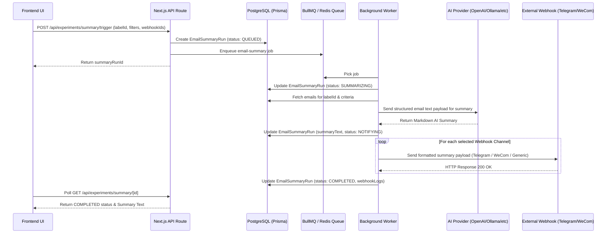

# AI Email Summary by Labels & Webhook Notifications Design

## Overview
This feature introduces an experimental AI-powered email summarization engine in MailHub. It allows users to summarize emails grouped under specific labels and dispatch formatted summaries via configured notification API channels (such as Telegram Webhooks, WeCom / Enterprise WeChat Webhooks, and Generic JSON Webhooks).

Processing is handled asynchronously via MailHub's existing BullMQ and Redis queue worker architecture to ensure non-blocking UI interactions, high scalability, and robust retry capabilities for LLM API and Webhook requests.

---

## User Flow & Requirements

1. **Experimental Settings Setup (`/settings/experiments`)**:
   - Enable/disable AI features per organization.
   - Configure LLM Provider settings: OpenAI, Claude, Ollama, or Custom OpenAI-compatible endpoint (API Key, Base URL, Model Name, custom prompt).
   - Add/manage Notification Webhook Channels:
     - **Telegram**: Bot Token + Chat ID.
     - **WeCom (Enterprise WeChat)**: Webhook URL.
     - **Generic Webhook**: Custom Endpoint URL + HTTP method / secret.
   - Test LLM API connectivity and send test notifications to configured channels.

2. **Summarize by Label Triggering**:
   - Access "AI Summary" button on Label pages or Label Management interface.
   - Modal prompt parameters:
     - Label selection.
     - Time range filter (e.g. Last 24 Hours, Last 7 Days, All).
     - Maximum email count limit.
     - Destination Webhook channels (checkbox list of active configured channels).
   - Click "Generate Summary" to enqueue background job.

3. **Execution & Results**:
   - Real-time progress indicator in modal showing queue status (`QUEUED` -> `SUMMARIZING` -> `NOTIFYING` -> `COMPLETED`).
   - Displays rendered Markdown summary with copy-to-clipboard functionality.
   - Displays status badges for each dispatched Webhook channel (`Telegram: Delivered`, `WeCom: Delivered`).

---

## Architecture & Data Flow



---

## Database Schema (Prisma)

```prisma
model ExperimentSetting {
  id             String   @id @default(uuid()) @db.Uuid
  organizationId String   @unique @map("organization_id") @db.Uuid
  isAiEnabled    Boolean  @default(true) @map("is_ai_enabled")
  
  aiProvider     String   @default("openai") @map("ai_provider") @db.VarChar(50)
  aiApiKey       String?  @map("ai_api_key")
  aiBaseUrl      String?  @map("ai_base_url") @db.VarChar(512)
  aiModelName    String   @default("gpt-4o-mini") @map("ai_model_name") @db.VarChar(100)
  aiCustomPrompt String?  @map("ai_custom_prompt")
  
  createdAt      DateTime @default(now()) @map("created_at") @db.Timestamptz
  updatedAt      DateTime @updatedAt @map("updated_at") @db.Timestamptz

  organization   Organization @relation(fields: [organizationId], references: [id], onDelete: Cascade)

  @@map("experiment_settings")
}

model NotificationWebhook {
  id             String   @id @default(uuid()) @db.Uuid
  organizationId String   @map("organization_id") @db.Uuid
  name           String   @db.VarChar(100)
  type           String   @db.VarChar(50) // "TELEGRAM", "WECOM", "GENERIC"
  config         Json     // Type-specific credentials & parameters
  isActive       Boolean  @default(true) @map("is_active")
  createdAt      DateTime @default(now()) @map("created_at") @db.Timestamptz
  updatedAt      DateTime @updatedAt @map("updated_at") @db.Timestamptz

  organization   Organization @relation(fields: [organizationId], references: [id], onDelete: Cascade)

  @@map("notification_webhooks")
}

model EmailSummaryRun {
  id             String   @id @default(uuid()) @db.Uuid
  organizationId String   @map("organization_id") @db.Uuid
  userId         String   @map("user_id") @db.Uuid
  labelId        String   @map("label_id") @db.Uuid
  labelName      String   @map("label_name") @db.VarChar(100)
  
  status         String   @default("QUEUED") @db.VarChar(50)
  emailCount     Int      @default(0) @map("email_count")
  summaryText    String?  @map("summary_text") @db.Text
  errorMessage   String?  @map("error_message")
  webhookLogs    Json?    @map("webhook_logs")

  createdAt      DateTime @default(now()) @map("created_at") @db.Timestamptz
  updatedAt      DateTime @updatedAt @map("updated_at") @db.Timestamptz

  @@map("email_summary_runs")
}
```

---

## Webhook Payload Specifications

### 1. Telegram Webhook
- Endpoint: `https://api.telegram.org/bot<botToken>/sendMessage`
- Method: `POST`
- Payload:
  ```json
  {
    "chat_id": "<chatId>",
    "text": "📧 *MailHub Summary: [Label Name]*\n\n[AI Summary Content]",
    "parse_mode": "Markdown"
  }
  ```

### 2. WeCom (Enterprise WeChat) Webhook
- Endpoint: `<webhookUrl>`
- Method: `POST`
- Payload:
  ```json
  {
    "msgtype": "markdown",
    "markdown": {
      "content": "### 📧 MailHub AI Summary: [Label Name]\n\n[AI Summary Content]"
    }
  }
  ```

### 3. Generic Webhook
- Endpoint: `<webhookUrl>`
- Method: `POST`
- Payload:
  ```json
  {
    "event": "email.summary",
    "label": "[Label Name]",
    "emailCount": 15,
    "summary": "[AI Summary Content]",
    "createdAt": "2026-08-04T14:20:00Z"
  }
  ```

---

## API Routes Plan
- `GET /api/experiments/settings`: Retrieve organization experimental & AI settings.
- `PUT /api/experiments/settings`: Update organization AI LLM settings.
- `GET /api/experiments/webhooks`: List configured webhooks.
- `POST /api/experiments/webhooks`: Create new notification webhook.
- `DELETE /api/experiments/webhooks/[id]`: Remove a notification webhook.
- `POST /api/experiments/webhooks/test`: Send instant test payload to a webhook.
- `POST /api/experiments/summary/trigger`: Enqueue summary background job.
- `GET /api/experiments/summary/[id]`: Check status and retrieve generated summary.

---

## Error Handling & Reliability
- **LLM Failures**: If AI API fails (e.g. rate limit, bad API key), mark job status as `FAILED` with `errorMessage` and display actionable error message to user.
- **Webhook Failures**: Webhook failures are isolated per channel; if Telegram fails but WeCom succeeds, the delivery log records Telegram failure while keeping overall summary status as completed with partial delivery warnings.
- **Empty Labels**: Handle labels with zero matching emails gracefully by notifying the user without calling LLM APIs.
