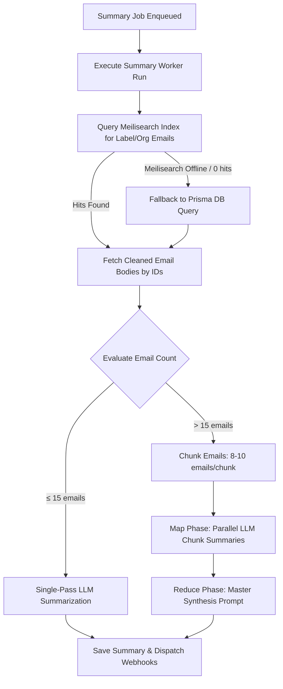

# Design Document: Meilisearch-Powered Email Querying & Adaptive Map-Reduce Summarization

**Date**: 2026-08-05  
**Target File**: `src/lib/queue/workers/summary.ts` & `src/lib/ai/summary-service.ts`

---

## 1. Goal & Context

When generating AI batch email summaries for a label or assigned account, fetching large numbers of emails via Prisma and feeding them directly into a single LLM prompt causes:
1. Context overflow or high latency ("needle in a haystack" quality degradation).
2. Missing key details when full email body content is involved.
3. Heavy PostgreSQL query load for complex relational joins.

This design introduces:
- **Meilisearch Email Querying**: Fast filter and sort retrieval for email headers/snippets.
- **Adaptive Map-Reduce Summarization**: Single-pass summarization for small email sets (≤ 15 emails) and chunked Map-Reduce for large sets (> 15 emails).
- **Sanitized Full Body Inclusion**: Truncating & cleaning email bodies to ensure high summary accuracy without prompt overload.

---

## 2. System Architecture & Data Flow



---

## 3. Detailed Component Specification

### A. Meilisearch Email Retrieval (`summary.ts`)
- Query Meilisearch `emails` index with filter:
  ```text
  organizationId = "<orgId>" AND (labelIds = "<labelId>" OR accountId IN [<assignedAccountIds>])
  ```
- Sort: `receivedAt:desc`
- Extract matching document IDs and snippets.
- If Meilisearch search fails or returns 0 indexed emails (index lag), seamlessly fallback to Prisma relational query.

### B. Body Sanitization & Batching (`summary-service.ts`)
- Fetch `EmailBody` for retrieved email IDs.
- Clean body text:
  - Strip raw HTML tags and base64 string dumps.
  - Trim excessive whitespace and signatures.
  - Limit per-email text to 2,000 characters (~400 tokens).

### C. Adaptive Map-Reduce Summarization (`summary-service.ts`)
- **Single-Pass (≤ 15 emails)**:
  - Combine emails into single prompt formatted with Subject, From, Date, Snippet/Body.
  - Generate summary.
- **Map-Reduce (> 15 emails)**:
  - **Map Step**: Group emails into chunks of 8–10 emails. Generate concise bullet-point summaries for each chunk.
  - **Reduce Step**: Pass all chunk mini-summaries to master synthesis prompt to produce the final executive summary.

---

## 4. Error Handling & Resilience

- **Meilisearch Failure**: Soft fallback to Prisma DB query without throwing unhandled job errors.
- **LLM Rate Limits / Failures**: Exponential backoff or retries managed by BullMQ job configuration.
- **Run Tracking**: Updates `EmailSummaryRun` status: `SUMMARIZING` ➔ `NOTIFYING` ➔ `COMPLETED` (or `FAILED` with explicit error logging).
